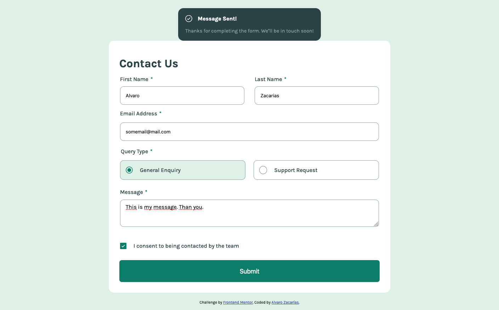

# Frontend Mentor - Contact form solution

This is a solution to the [Contact form challenge on Frontend Mentor](https://www.frontendmentor.io/challenges/contact-form--G-hYlqKJj). Frontend Mentor challenges help you improve your coding skills by building realistic projects. 

## Table of contents

- [Overview](#overview)
  - [The challenge](#the-challenge)
  - [Screenshot](#screenshot)
  - [Links](#links)
- [My process](#my-process)
  - [Built with](#built-with)
  - [What I learned](#what-i-learned)
  - [Continued development](#continued-development)
  - [Useful resources](#useful-resources)
- [Author](#author)
- [Acknowledgments](#acknowledgments)

## Overview

### The challenge

Users should be able to:

- Complete the form and see a success toast message upon successful submission
- Receive form validation messages if:
  - A required field has been missed
  - The email address is not formatted correctly
- Complete the form only using their keyboard
- Have inputs, error messages, and the success message announced on their screen reader
- View the optimal layout for the interface depending on their device's screen size
- See hover and focus states for all interactive elements on the page

### Screenshot

### Links

- Solution URL: [https://github.com/alvarozama/Contact-form]
- Live Site URL: [https://alvarozama.github.io/Contact-form/]

## My process

### Built with

- Semantic HTML5 markup
- CSS custom properties
- Flexbox
- Mobile-first workflow

### What I learned

More than anything, this project allowed me to reinforce some of the concepts previously covered regarding validation of forms while also allowing me to understand how to implement accessibility measures and why they are important.

### Continued development

I'd like to keep exploring better, more efficient ways to validate forms.

### Useful resources

- [Radio button validation](https://www.youtube.com/watch?v=F17OHgejQeI&list=PLkkUzJo2dDQgNJgUvexOzePB7cpL89Kwa&index=29&t=78s) - This helped me undertand a way to validate wether a radio button had been checked.
- [Checkbox validation](https://www.youtube.com/watch?v=MBUc-hfxB2s&list=PLkkUzJo2dDQgNJgUvexOzePB7cpL89Kwa&index=27&t=14s&ab_channel=Bharaththippireddy) - This video helped me understand wheter or not a checkbox had been checked.
- [CSS transitions](https://www.youtube.com/watch?v=4prVdA7_6u0&t=173s&ab_channel=KevinPowell) - This video helped me with a simple little way to animate a transition for the success message.

## Author

- Frontend Mentor - [@alvarozama](https://www.frontendmentor.io/profile/alvarozama)

